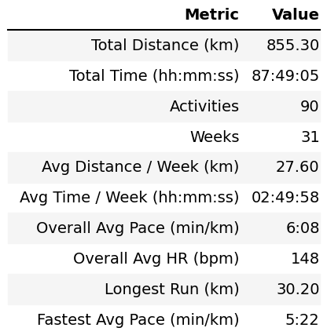
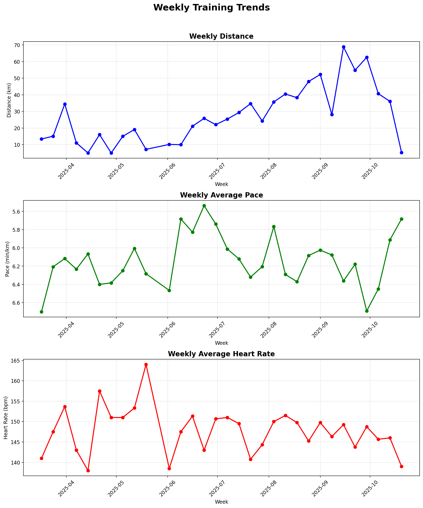
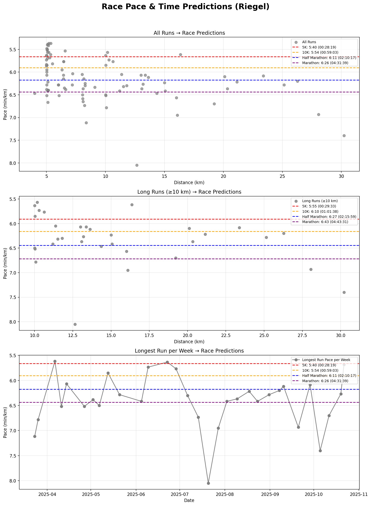
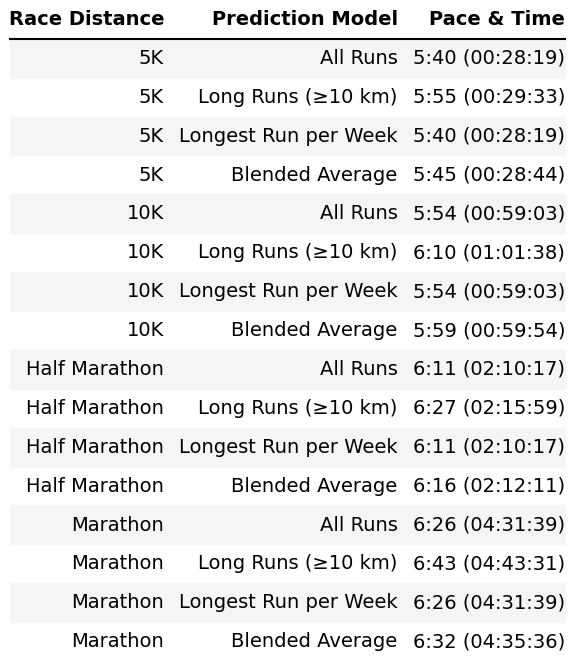

# 🏃‍♂️ Runalytics

A free, open-source Python script to analyze your running data and predict race performance for **5K, 10K, Half Marathon, and Marathon** distances using the Riegel formula. While there are many paid training analysis tools available, this simple script provides essential insights for runners who want to understand their training progress without subscriptions or complex software.

## Purpose

I created this tool for my own running training analysis and decided to share it with the running community. It takes your exported Garmin running data and generates comprehensive visual reports including:

- **Training statistics** - Overall and weekly averages
- **Multi-race pace predictions** - Using the proven Riegel formula for 5K, 10K, Half Marathon, and Marathon
- **Training trends** - Weekly progress in distance, pace, and heart rate
- **Performance analysis** - Charts showing your running data from different perspectives

## Features

The script generates 4 PNG files in the `./output` directory:

1. **`general_stats.png`** - Summary table with key training metrics
2. **`race_predictions.png`** - Three prediction charts for all race distances using different data subsets
3. **`weekly_trends.png`** - Time-series charts showing training progression
4. **`race_predictions_table.png`** - Clean table with predicted times for 5K, 10K, Half Marathon, and Marathon

## Setup

### Requirements

- Python 3.7+
- Required packages (install via `pip install -r requirements.txt`):
  ```
  pandas>=1.3.0
  matplotlib>=3.5.0
  jinja2>=3.0.0
  dataframe_image>=0.1.1
  ```

### Installation

1. Clone or download this repository
2. Install dependencies:
   ```bash
   pip install -r requirements.txt
   ```

## Usage

### 1. Export Your Data

Export your running activities from Garmin Connect:

- Go to Garmin Connect web interface
- Navigate to Activities → All Activities
- Select your runs and export as CSV
- Save as `data.csv` in the project directory

**Required columns in your CSV:**

- `Date` - Activity date
- `Distance` - Run distance (km)
- `Avg HR` - Average heart rate (bpm)
- `Avg Pace` - Average pace (mm:ss format)

**Optional columns** (for more accurate time calculations):

- `Moving Time` / `Elapsed Time` / `Time` - Duration in hh:mm:ss format

### 2. Run the Analysis

```bash
python run.py
```

The script will generate all reports in the `./output` folder.

### 3. Customize Settings

Edit the configuration section in `run.py`:

- `LONG_RUN_THRESHOLD_KM` - Minimum distance for "long runs" (default: 10km)
- `RIEGEL_EXPONENT` - Riegel formula exponent (default: 1.06, range: 1.04-1.09)

## Generated Reports

### General Statistics (`general_stats.png`)

Summary table showing your overall training metrics:

- Total distance and time
- Number of activities and training weeks
- Weekly averages for distance and time
- Overall average pace and heart rate
- Longest run and fastest pace



### Weekly Training Trends (`weekly_trends.png`)

Time-series analysis of your training progression:

- **Weekly Distance** - Total km per week over time
- **Weekly Average Pace** - Pace improvement trends
- **Weekly Average Heart Rate** - Fitness and effort trends



### Race Predictions (`race_predictions.png`)

Three different approaches to predict your race performance using the Riegel formula for **all major race distances**:

1. **All Runs** - Uses your most recent run as baseline
2. **Long Runs (≥10km)** - Uses your most recent long run for better endurance prediction
3. **Longest Run per Week** - Tracks your weekly long run progression

Each chart shows your data points with predicted pace lines for:

- **5K** (red lines)
- **10K** (orange lines)
- **Half Marathon** (blue lines)
- **Marathon** (purple lines)

The predictions help you understand your potential across different race distances based on your current fitness level.



### Race Predictions Table (`race_predictions_table.png`)

Comprehensive summary table showing predicted pace and finish time for each race distance (5K, 10K, Half Marathon, Marathon) using all three prediction models, plus blended averages for each distance.



## Understanding the Riegel Formula

The [Riegel formula](https://en.wikipedia.org/wiki/Riegel_formula) predicts race performance based on a reference performance at a different distance:

```
T2 = T1 × (D2/D1)^1.06
```

Where:

- T1 = Time for known distance D1
- T2 = Predicted time for distance D2
- 1.06 = Riegel exponent (adjustable in settings)

This tool applies the formula using your recent runs as reference points to predict performance across all major race distances:

- **5K** (5.0 km)
- **10K** (10.0 km)
- **Half Marathon** (21.0975 km)
- **Marathon** (42.195 km)

The multi-distance approach gives you a complete picture of your racing potential at different effort levels and helps with race selection and goal setting.

## Data Sources

### Garmin Users

Export directly from Garmin Connect as described above.

### Other Devices/Platforms

The script expects a CSV with the required columns. You may need to:

- Convert your data format (Strava, Polar, etc.)
- Ensure column names match the expected format
- Adjust pace format if needed (currently expects mm:ss)

## Contributing

This is a personal project shared freely with the running community. Feel free to:

- Fork and modify for your needs
- Submit issues or suggestions
- Adapt for other data sources or metrics

## Limitations

- Designed for Garmin CSV export format
- Race predictions are estimates based on recent performance
- Accuracy depends on data quality and training consistency
- Riegel formula works best for distances between 1500m and marathon
- Not a substitute for professional coaching or sports science analysis

## License

Open source - use freely for personal training analysis.

---

_Happy running! 🏃‍♂️_
